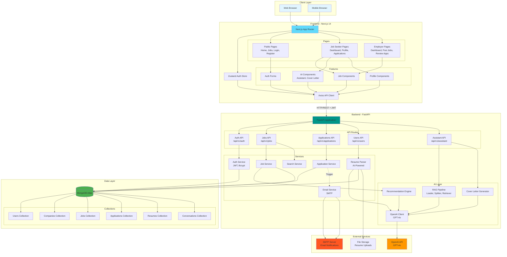

# TalentNest Job Portal

A modern, AI-powered job portal connecting job seekers with employers. Built with FastAPI, Next.js 14, MongoDB, and OpenAI GPT-4o.

## 📊 Project Status

**Current Phase:** Phase 3 Complete | **Next:** Phase 4 (Polish & Testing)

### ✅ Implemented Features

#### Phase 1: Foundation ✅
- ✅ FastAPI backend with async/await
- ✅ Next.js 14 frontend with App Router
- ✅ MongoDB Atlas integration with Beanie ODM
- ✅ JWT authentication (register, login, logout)
- ✅ Role-based access control (Job Seeker / Employer)
- ✅ Docker containerization with docker-compose
- ✅ Comprehensive documentation

#### Phase 2: Core Features ✅
- ✅ Job seeker profile management
- ✅ Resume upload and AI parsing (PDF/DOCX)
- ✅ Job search with filters (location, type, experience)
- ✅ Job application system with cover letters
- ✅ Employer job posting (CRUD operations)
- ✅ Application review and management
- ✅ Email notification system (SMTP)
- ✅ Application status tracking

#### Phase 3: AI Features ✅
- ✅ AI job recommendations for job seekers
- ✅ AI candidate matching for employers
- ✅ AI cover letter generation (GPT-4o)
- ✅ RAG-based AI career assistant
- ✅ Resume parsing with skill extraction

#### 🚧 In Progress / Planned
- ⏳ Interview scheduling system
- ⏳ UI/UX polish and responsive design
- ⏳ Comprehensive testing suite
- ⏳ Architecture and ERD diagrams
- ⏳ Production deployment optimization

---

## 🏗️ System Architecture

> **📌 Note**: The diagrams below are best viewed on GitHub or using a Mermaid-compatible viewer. In your IDE, you can zoom in on the preview or view the raw Mermaid code for details.

### System Flow Diagram



### Key Architectural Highlights

#### 🎯 **Separation of Concerns**
- **Frontend (Next.js 14)**: Handles UI/UX, client-side routing, and state management
- **Backend (FastAPI)**: Manages business logic, data validation, and API endpoints
- **Database (MongoDB)**: Stores all application data with flexible schema
- **AI Layer**: Isolated AI services for resume parsing, recommendations, and chat

#### 🔐 **Security Architecture**
- **JWT Authentication**: Stateless authentication with Bearer tokens
- **Password Hashing**: Bcrypt with salt rounds for secure password storage
- **Role-Based Access Control (RBAC)**: Separate permissions for Job Seekers and Employers
- **CORS Configuration**: Controlled cross-origin resource sharing
- **Environment Variables**: Sensitive credentials isolated in `.env` files

#### 🚀 **Performance Optimizations**
- **Async/Await**: FastAPI uses async operations for non-blocking I/O
- **Connection Pooling**: MongoDB connection pooling for efficient database access
- **Next.js App Router**: Automatic code splitting and optimized loading
- **Docker Multi-Stage Builds**: Minimal production image sizes
- **Caching**: API client caching for repeated requests

#### 🤖 **AI Integration**
- **OpenAI GPT-4o**: Powers resume parsing, cover letter generation, and recommendations
- **RAG Pipeline**: Retrieval-Augmented Generation for context-aware AI assistant
- **Graceful Degradation**: AI features optional; app works without OpenAI API key
- **Background Processing**: AI tasks run asynchronously to avoid blocking

#### 📧 **Communication Layer**
- **SMTP Email Service**: Automated notifications for application events
- **HTML Email Templates**: Professional, responsive email designs
- **Background Tasks**: Email sending happens asynchronously
- **Error Handling**: Graceful fallback if email service unavailable

#### 📊 **Data Flow**
1. **User Action** → Frontend captures input
2. **API Request** → Axios sends HTTP request with JWT
3. **Backend Processing** → FastAPI validates, processes, and applies business logic
4. **Database Operation** → MongoDB stores/retrieves data via Beanie ODM
5. **AI Processing** (if needed) → OpenAI API called for AI features
6. **Response** → Backend returns structured JSON response
7. **UI Update** → Frontend updates state and re-renders components

#### 🔄 **State Management**
- **Zustand Store**: Lightweight global state for authentication
- **React Hook Form**: Local form state with validation
- **Server State**: API responses cached and managed by React Query patterns
- **LocalStorage**: Persistent JWT token storage

---

## 🎨 Frontend Architecture

### Frontend Architectural Diagram

```mermaid
graph TB
    subgraph "Next.js 14 App Router"
        AppRoot[app/ Root]
        
        subgraph "Public Routes"
            HomePage["page.tsx<br/>Landing Page"]
            LoginPage["login/page.tsx"]
            RegisterPage["register/page.tsx"]
            JobsPage["jobs/page.tsx<br/>Job Listings"]
            JobDetailPage["jobs/:id/page.tsx<br/>Job Details"]
        end
        
        subgraph "Job Seeker Routes"
            JSDashboard["dashboard/page.tsx"]
            JSProfile["dashboard/profile/page.tsx"]
            JSApplications["dashboard/applications/page.tsx"]
            JSRecommendations["dashboard/recommendations/page.tsx"]
            JSAssistant["dashboard/assistant/page.tsx"]
            JSInterviews["dashboard/interviews/page.tsx"]
        end
        
        subgraph "Employer Routes"
            EMPDashboard["employer/dashboard/page.tsx"]
            EMPJobs["employer/jobs/page.tsx"]
            EMPNewJob["employer/jobs/new/page.tsx"]
            EMPEditJob["employer/jobs/:id/edit/page.tsx"]
            EMPApplications["employer/jobs/:id/applications/page.tsx"]
            EMPInterviews["employer/interviews/page.tsx"]
        end
    end
    
    subgraph "Components Layer"
        subgraph "Layout Components"
            Navbar["Navbar<br/>Auth-aware navigation"]
            Footer["Footer<br/>Site footer"]
            DashboardLayout["DashboardLayout<br/>Sidebar + content"]
        end
        
        subgraph "UI Components"
            Button["Button"]
            Input["Input"]
            Card["Card"]
            Modal["Modal"]
            Select["Select"]
            Textarea["Textarea"]
            Badge["Badge"]
        end
    end
    
    subgraph "Features Layer"
        subgraph "Auth Features"
            LoginForm["LoginForm<br/>Email + Password"]
            RegisterForm["RegisterForm<br/>Role selection"]
        end
        
        subgraph "Job Features"
            JobCard["JobCard<br/>Job preview"]
            JobFilters["JobFilters<br/>Search & filter"]
            ApplyModal["ApplyModal<br/>Application form"]
        end
        
        subgraph "Profile Features"
            ProfileForm["ProfileForm<br/>User info"]
            ResumeUpload["ResumeUpload<br/>File upload"]
            SkillsManager["SkillsManager<br/>Skills list"]
        end
        
        subgraph "AI Features"
            ChatInterface["ChatInterface<br/>AI Assistant"]
            CoverLetterGen["CoverLetterGenerator<br/>AI-powered"]
            RecommendationCard["RecommendationCard<br/>Job matches"]
        end
        
        subgraph "Employer Features"
            JobPostForm["JobPostForm<br/>Create/Edit job"]
            CandidateCard["CandidateCard<br/>Application review"]
            ApplicationFilters["ApplicationFilters<br/>Status filters"]
        end
    end
    
    subgraph "State Management"
        AuthStore["authStore.ts<br/>Zustand"]
        
        subgraph "Auth State"
            User["user: User or null"]
            Token["token: string or null"]
            IsAuth["isAuthenticated: boolean"]
        end
        
        subgraph "Auth Actions"
            Login["login"]
            Logout["logout"]
            SetUser["setUser"]
        end
    end
    
    subgraph "API Layer"
        APIClient["api.ts<br/>Axios Client"]
        
        subgraph "API Methods"
            AuthAPI["register, login"]
            JobsAPI["getJobs, getJob, createJob"]
            AppsAPI["apply, getApplications"]
            UsersAPI["getProfile, updateProfile"]
            ResumeAPI["uploadResume"]
            AssistantAPI["chat, generateCoverLetter"]
        end
    end
    
    subgraph "Utilities"
        Hooks["hooks/<br/>useAuth, useDebounce"]
        Utils["utils.ts<br/>Helpers"]
        Types["types/<br/>TypeScript definitions"]
        Constants["constants/<br/>App constants"]
    end
    
    %% App Router Flow
    AppRoot --> HomePage
    AppRoot --> LoginPage
    AppRoot --> RegisterPage
    AppRoot --> JobsPage
    AppRoot --> JobDetailPage
    AppRoot --> JSDashboard
    AppRoot --> JSProfile
    AppRoot --> JSApplications
    AppRoot --> JSRecommendations
    AppRoot --> JSAssistant
    AppRoot --> JSInterviews
    AppRoot --> EMPDashboard
    AppRoot --> EMPJobs
    AppRoot --> EMPNewJob
    AppRoot --> EMPEditJob
    AppRoot --> EMPApplications
    AppRoot --> EMPInterviews
    
    %% Layout Usage
    HomePage --> Navbar
    HomePage --> Footer
    JSDashboard --> DashboardLayout
    EMPDashboard --> DashboardLayout
    
    %% Pages to Features
    LoginPage --> LoginForm
    RegisterPage --> RegisterForm
    JobsPage --> JobCard
    JobsPage --> JobFilters
    JobDetailPage --> ApplyModal
    JSProfile --> ProfileForm
    JSProfile --> ResumeUpload
    JSProfile --> SkillsManager
    JSAssistant --> ChatInterface
    JSRecommendations --> RecommendationCard
    ApplyModal --> CoverLetterGen
    EMPNewJob --> JobPostForm
    EMPApplications --> CandidateCard
    EMPApplications --> ApplicationFilters
    
    %% Features to UI Components
    LoginForm --> Button
    LoginForm --> Input
    RegisterForm --> Button
    RegisterForm --> Input
    RegisterForm --> Select
    JobCard --> Card
    JobCard --> Badge
    ApplyModal --> Modal
    ApplyModal --> Textarea
    ProfileForm --> Input
    ProfileForm --> Button
    ChatInterface --> Card
    ChatInterface --> Input
    
    %% Features to API
    LoginForm --> APIClient
    RegisterForm --> APIClient
    JobCard --> APIClient
    ApplyModal --> APIClient
    ProfileForm --> APIClient
    ResumeUpload --> APIClient
    ChatInterface --> APIClient
    CoverLetterGen --> APIClient
    JobPostForm --> APIClient
    CandidateCard --> APIClient
    
    %% API Client Methods
    APIClient --> AuthAPI
    APIClient --> JobsAPI
    APIClient --> AppsAPI
    APIClient --> UsersAPI
    APIClient --> ResumeAPI
    APIClient --> AssistantAPI
    
    %% State Management
    LoginForm --> AuthStore
    RegisterForm --> AuthStore
    Navbar --> AuthStore
    DashboardLayout --> AuthStore
    
    AuthStore --> User
    AuthStore --> Token
    AuthStore --> IsAuth
    AuthStore --> Login
    AuthStore --> Logout
    AuthStore --> SetUser
    
    %% Utilities
    LoginForm --> Hooks
    ProfileForm --> Hooks
    APIClient --> Utils
    LoginForm --> Types
    JobCard --> Types
    JobsPage --> Constants

    style AppRoot fill:#61dafb
    style AuthStore fill:#764abc
    style APIClient fill:#ff6b6b
    style Navbar fill:#4ecdc4
    style DashboardLayout fill:#4ecdc4
```



### Frontend Architectural Highlights

#### 🎯 **Next.js 14 App Router**
- **File-Based Routing**: Automatic route generation from folder structure
- **Server Components**: Default server-side rendering for optimal performance
- **Client Components**: Interactive components with `'use client'` directive
- **Nested Layouts**: Shared layouts for dashboard and employer sections
- **Dynamic Routes**: `[id]` for job details and application pages
- **Loading States**: Built-in loading.tsx for better UX

#### 🧩 **Component Architecture**
- **Atomic Design**: UI components (Button, Input) → Feature components (LoginForm) → Pages
- **Reusability**: 40+ components designed for maximum reuse
- **Composition**: Complex features built from simple UI components
- **Props Interface**: Strict TypeScript interfaces for all component props
- **Feature Folders**: Related components grouped by feature (auth, jobs, profile, etc.)

#### 📦 **State Management Strategy**
- **Global State (Zustand)**: Authentication state (user, token, isAuthenticated)
- **Local State (useState)**: Component-specific UI state (modals, dropdowns)
- **Form State (React Hook Form)**: Form data with validation
- **Server State**: API responses managed with React patterns
- **Persistent State**: JWT token stored in localStorage for session persistence

#### 🔌 **API Integration**
- **Centralized Client**: Single `api.ts` file with all API methods
- **Axios Instance**: Configured with base URL and JWT interceptor
- **Automatic Auth**: JWT token automatically attached to all requests
- **Error Handling**: Consistent error handling across all API calls
- **Type Safety**: All API methods have TypeScript return types

#### 🎨 **Styling System**
- **Tailwind CSS**: Utility-first CSS framework
- **Custom Design System**: Consistent colors, spacing, and typography
- **TalentNest Branding**: Primary blue (#075299) used throughout
- **Responsive Design**: Mobile-first approach with breakpoints
- **Dark Mode Ready**: Tailwind dark mode classes prepared (not yet activated)

#### 🔐 **Authentication Flow**
1. **User Registration/Login** → Form submission
2. **API Call** → `api.register()` or `api.login()`
3. **Token Received** → JWT token from backend
4. **Store Update** → Zustand `setUser()` and `setToken()`
5. **LocalStorage** → Token persisted for page refreshes
6. **Route Protection** → Middleware checks auth state
7. **Role-Based Routing** → Redirect to appropriate dashboard

#### 🛣️ **Routing Strategy**
- **Public Routes**: `/`, `/jobs`, `/jobs/[id]`, `/login`, `/register`
- **Job Seeker Routes**: `/dashboard/*` (protected)
- **Employer Routes**: `/employer/*` (protected)
- **Role-Based Access**: Middleware checks user role for access control
- **Automatic Redirects**: Unauthenticated users redirected to login

#### 📱 **Responsive Design**
- **Mobile-First**: Base styles for mobile, enhanced for desktop
- **Breakpoints**: `sm:`, `md:`, `lg:`, `xl:` for different screen sizes
- **Flexible Layouts**: Grid and flexbox for adaptive layouts
- **Touch-Friendly**: Large tap targets for mobile users
- **Sidebar Collapse**: Dashboard sidebar collapses on mobile

#### ⚡ **Performance Optimizations**
- **Code Splitting**: Automatic route-based code splitting
- **Lazy Loading**: Components loaded on demand
- **Image Optimization**: Next.js Image component for optimized images
- **Bundle Size**: Tree-shaking removes unused code
- **Production Build**: Minified and optimized for production

#### 🧪 **Type Safety**
- **TypeScript**: Strict type checking throughout
- **Interface Definitions**: All data structures typed in `types/index.ts`
- **API Response Types**: Backend responses have matching frontend types
- **Component Props**: All props strictly typed
- **Compile-Time Safety**: Catch errors before runtime

#### 🎭 **User Experience**
- **Loading States**: Skeleton screens and spinners during data fetch
- **Error Handling**: User-friendly error messages
- **Form Validation**: Real-time validation with helpful messages
- **Success Feedback**: Toast notifications for successful actions
- **Empty States**: Helpful messages when no data available
- **Smooth Transitions**: CSS transitions for better feel

---

## 🚀 Features

### For Job Seekers
- 📝 **Profile Management** - Create and update professional profiles
- 📄 **Resume Upload** - Upload PDF/DOCX resumes with AI parsing
- 🔍 **Job Search** - Search and filter jobs by location, type, experience level
- 💼 **Apply to Jobs** - Submit applications with AI-generated cover letters
- 📊 **Application Tracking** - Monitor application status in real-time
- 🤖 **AI Recommendations** - Get personalized job matches based on your profile
- 💬 **AI Career Assistant** - Chat with an AI assistant for career guidance

### For Employers
- 📢 **Job Posting** - Create, edit, and manage job listings
- 👥 **Application Review** - View and manage candidate applications
- ✅ **Candidate Actions** - Shortlist, reject, or update application status
- 📧 **Email Notifications** - Automated notifications for application events
- 🎯 **AI Candidate Matching** - Get AI-powered candidate recommendations
- 📊 **Dashboard Analytics** - Track job postings and application metrics

### AI-Powered Features
- 🧠 **Resume Parsing** - Extract skills, experience, and education from resumes
- 📝 **Cover Letter Generation** - AI-generated personalized cover letters
- 🎯 **Job Recommendations** - Machine learning-based job matching
- 🤝 **Candidate Matching** - AI-powered candidate ranking for jobs
- 💬 **RAG Assistant** - Retrieval-Augmented Generation chatbot with job portal knowledge

## 🛠️ Tech Stack

### Backend
- **Framework**: FastAPI (Python 3.11+) with async/await
- **Database**: MongoDB Atlas with Beanie ODM
- **Authentication**: JWT with bcrypt password hashing
- **AI/ML**: OpenAI GPT-4o for AI features
- **Email**: SMTP with aiosmtplib for notifications
- **File Processing**: PyPDF2, python-docx for resume parsing
- **Validation**: Pydantic v2 for data validation

### Frontend
- **Framework**: Next.js 14 (App Router)
- **Language**: TypeScript with strict type checking
- **Styling**: Tailwind CSS with custom design system
- **State Management**: Zustand for auth and global state
- **HTTP Client**: Axios with JWT interceptor
- **Forms**: React Hook Form with validation
- **Icons**: Lucide React

### DevOps
- **Containerization**: Docker with multi-stage builds
- **Orchestration**: Docker Compose
- **Database**: MongoDB Atlas (cloud) or local MongoDB
- **Environment**: .env configuration management

## 📦 Installation & Setup

### Prerequisites
- Python 3.11 or higher
- Node.js 20 or higher
- MongoDB Atlas account (or local MongoDB)
- Docker & Docker Compose (for containerized deployment)

### Option 1: Docker Setup (Recommended)

1. **Clone the repository**:
   ```bash
   git clone <repository-url>
   cd JobPortal
   ```

2. **Set up environment variables**:
   ```bash
   # Backend
   cp backend/.env.example backend/.env
   # Edit backend/.env with your actual values
   
   # Frontend
   cp frontend/.env.example frontend/.env.local
   # Edit frontend/.env.local with your actual values
   ```

3. **Build and run with Docker Compose**:
   ```bash
   # From project root
   docker-compose -f docker/docker-compose.yml up --build
   
   # Or from docker directory
   cd docker
   docker-compose up --build
   ```

4. **Access the application**:
   - Frontend: http://localhost:3000
   - Backend API: http://localhost:8000
   - API Documentation: http://localhost:8000/docs

5. **Stop the application**:
   ```bash
   # From project root
   docker-compose -f docker/docker-compose.yml down
   
   # Or from docker directory
   cd docker
   docker-compose down
   ```

For detailed Docker documentation, see [docker/README.md](./docker/README.md)

### Option 2: Manual Setup

#### Backend Setup

1. **Navigate to backend directory**:
   ```bash
   cd backend
   ```

2. **Create and activate virtual environment**:
   ```bash
   # Windows
   python -m venv venv
   .\venv\Scripts\Activate.ps1
   
   # Linux/Mac
   python3 -m venv venv
   source venv/bin/activate
   ```

3. **Install dependencies**:
   ```bash
   pip install -r requirements.txt
   ```

4. **Set up environment variables**:
   ```bash
   cp .env.example .env
   # Edit .env with your actual values
   ```

5. **Run the backend**:
   ```bash
   # Python 3.13+ on Windows (no auto-reload)
   python -m uvicorn app.main:app --host 127.0.0.1 --port 8000
   
   # Python < 3.13 or Linux/Mac (with auto-reload)
   python -m uvicorn app.main:app --host 127.0.0.1 --port 8000 --reload
   ```

#### Frontend Setup

1. **Navigate to frontend directory**:
   ```bash
   cd frontend
   ```

2. **Install dependencies**:
   ```bash
   npm install
   ```

3. **Set up environment variables**:
   ```bash
   cp .env.example .env.local
   # Edit .env.local with your actual values
   ```

4. **Run the frontend**:
   ```bash
   npm run dev
   ```

5. **Access the application**:
   - Frontend: http://localhost:3000
   - Backend API: http://localhost:8000

## 🔧 Configuration

### Backend Environment Variables

Required variables in `backend/.env`:
- `MONGODB_URI`: MongoDB connection string
- `DATABASE_NAME`: Database name (default: TalentNest)
- `SECRET_KEY`: JWT secret key (generate a strong random string)
- `CORS_ORIGINS`: Allowed origins (e.g., http://localhost:3000)

Optional variables:
- `OPENAI_API_KEY`: For AI features (cover letter, assistant)
- `SMTP_*`: For email notifications

See `backend/.env.example` for all available options.

### Frontend Environment Variables

Required variables in `frontend/.env.local`:
- `NEXT_PUBLIC_API_URL`: Backend API URL (default: http://localhost:8000)

## 📚 API Documentation

Once the backend is running, visit:
- **Swagger UI**: http://localhost:8000/docs
- **ReDoc**: http://localhost:8000/redoc

## 🧪 Testing

### Backend Testing
```bash
cd backend
pytest
```

### Frontend Testing
```bash
cd frontend
npm test
```

## 🐳 Docker Commands

All Docker files are located in the `docker/` directory.

### Build images
```bash
docker-compose -f docker/docker-compose.yml build
```

### Run in detached mode
```bash
docker-compose -f docker/docker-compose.yml up -d
```

### View logs
```bash
docker-compose -f docker/docker-compose.yml logs -f
```

### Stop containers
```bash
docker-compose -f docker/docker-compose.yml down
```

### Remove volumes
```bash
docker-compose -f docker/docker-compose.yml down -v
```

### Rebuild and restart
```bash
docker-compose -f docker/docker-compose.yml up --build --force-recreate
```

For more Docker commands and troubleshooting, see [docker/README.md](./docker/README.md)

## 📁 Project Structure

```
JobPortal/
├── backend/                    # FastAPI backend
│   ├── app/
│   │   ├── ai/                # AI features
│   │   │   ├── agents/        # AI agents
│   │   │   ├── chains/        # LangChain chains
│   │   │   ├── prompts/       # AI prompts
│   │   │   ├── providers/     # OpenAI client
│   │   │   └── rag/           # RAG pipeline (loader, splitter, retriever, QA)
│   │   ├── api/               # API routes
│   │   │   └── v1/routes/     # Auth, jobs, applications, assistant, etc.
│   │   ├── core/              # Core configuration
│   │   ├── db/                # Database initialization
│   │   ├── models/            # Beanie ODM models (User, Job, Application, etc.)
│   │   ├── schemas/           # Pydantic request/response schemas
│   │   ├── services/          # Business logic (email, resume parser, search)
│   │   ├── templates/         # Email templates
│   │   ├── workers/tasks/     # Background tasks
│   │   └── main.py            # FastAPI application entry point
│   ├── uploads/resumes/       # Uploaded resume files
│   ├── .env.example           # Environment template
│   ├── requirements.txt       # Python dependencies
│   ├── TESTING_BACKEND.md     # Backend testing guide
│   └── README.md              # Backend documentation
├── frontend/                  # Next.js 14 frontend
│   ├── app/                   # App Router pages
│   │   ├── dashboard/         # Job seeker pages
│   │   ├── employer/          # Employer pages
│   │   ├── jobs/              # Job listings and details
│   │   ├── login/             # Login page
│   │   └── register/          # Registration page
│   ├── components/            # Reusable UI components
│   │   ├── layout/            # Navbar, Footer, DashboardLayout
│   │   └── ui/                # Button, Input, Card, Modal, etc.
│   ├── features/              # Feature-specific components
│   │   ├── auth/              # Login/Register forms
│   │   ├── jobs/              # Job cards, filters, apply modal
│   │   ├── profile/           # Profile forms
│   │   ├── assistant/         # AI chat interface, cover letter generator
│   │   └── employer/          # Employer-specific components
│   ├── hooks/                 # Custom React hooks
│   ├── lib/                   # API client and utilities
│   ├── store/                 # Zustand state management
│   ├── types/                 # TypeScript type definitions
│   ├── .env.example           # Environment template
│   ├── package.json           # Node dependencies
│   ├── FRONTEND_GUIDE.md      # Frontend guide
│   └── README.md              # Frontend documentation
├── docker/                    # Docker configuration
│   ├── backend.Dockerfile     # Backend Docker image
│   ├── frontend.Dockerfile    # Frontend Docker image
│   ├── docker-compose.yml     # Multi-container orchestration
│   └── README.md              # Docker setup guide with OS-specific instructions
├── DB_ContentGen/             # Database seeding utilities
│   ├── candidate_generator.py # Generate test candidates
│   ├── employer_generator.py  # Generate test employers
│   ├── job_generator.py       # Generate test jobs
│   ├── application_generator.py # Generate test applications
│   └── README.md              # Database seeding documentation
├── project-spec/              # Project specifications
│   └── *.md                   # Detailed project specs and walkthroughs
├── JobPortal Implementation Plan.md  # Complete implementation roadmap
├── TESTING_REPORT.md          # Phase 1 testing report
├── FRONTEND_GUIDE.md          # Complete frontend guide
├── FRONTEND_COMPLETION_SUMMARY.md  # Frontend feature checklist
└── README.md                  # This file
```

## 🤝 Contributing

1. Fork the repository
2. Create a feature branch (`git checkout -b feat/feature-name`)
3. Commit your changes (`git commit -m 'Add feature'`)
4. Push to the branch (`git push origin feat/feature-name`)
5. Open a Pull Request

## 📝 License

This project is part of an academic assignment.

## 👥 Team

Developed as part of a collaborative software engineering project.

## 🗄️ Database Seeding

To populate the database with sample data for testing and development:

```bash
cd DB_ContentGen

# Install dependencies
pip install -r requirements.txt

# Configure environment
cp env_example.txt .env
# Edit .env with your MongoDB credentials

# Generate sample data
python candidate_generator.py    # Generate job seekers
python employer_generator.py     # Generate employers
python job_generator.py          # Generate job postings
python application_generator.py  # Generate applications
```

See [DB_ContentGen/README.md](./DB_ContentGen/README.md) for detailed instructions.

## 🐛 Troubleshooting

### Common Issues

**Backend won't start:**
- Ensure Python 3.11+ is installed: `python --version`
- Check MongoDB connection string in `.env`
- Verify all dependencies are installed: `pip install -r requirements.txt`
- For Python 3.13 on Windows: Auto-reload is disabled (known issue)

**Frontend won't start:**
- Ensure Node.js 20+ is installed: `node --version`
- Clear cache: `rm -rf .next node_modules && npm install`
- Check `NEXT_PUBLIC_API_URL` in `.env.local`

**Docker issues:**
- Port conflicts: Stop services using ports 3000, 8000, or 27017
- Permission errors: Run Docker as administrator (Windows) or with sudo (Linux)
- Build failures: Clear Docker cache: `docker system prune -a`
- See [docker/README.md](./docker/README.md) for comprehensive troubleshooting

**Database connection errors:**
- Verify MongoDB Atlas credentials
- Check IP whitelist in MongoDB Atlas (allow 0.0.0.0/0 for development)
- Test connection: `python backend/test_connectivity_to_mongoDB.py`

**AI features not working:**
- Verify `OPENAI_API_KEY` is set in backend `.env`
- Check OpenAI API quota and billing
- AI features gracefully degrade if API key is missing

For more help, see individual component READMEs or check the [TESTING_REPORT.md](./TESTING_REPORT.md).

## 📚 Documentation

### Core Documentation
- **[Implementation Plan](./JobPortal%20Implementation%20Plan.md)** - Complete development roadmap with all phases
- **[Testing Report](./TESTING_REPORT.md)** - Phase 1 testing results and bug fixes
- **[Frontend Guide](./FRONTEND_GUIDE.md)** - Complete frontend documentation
- **[Frontend Completion Summary](./FRONTEND_COMPLETION_SUMMARY.md)** - Feature checklist

### Component Documentation
- **[Backend Testing Guide](./backend/TESTING_BACKEND.md)** - API testing instructions
- **[Backend README](./backend/README.md)** - Backend-specific documentation
- **[Frontend README](./frontend/README.md)** - Frontend-specific documentation
- **[Docker README](./docker/README.md)** - Docker setup with OS-specific instructions
- **[DB Content Generator](./DB_ContentGen/README.md)** - Database seeding guide

### Project Specifications
- **[Project Spec 1](./project-spec/JobPortal%20-%20Project%20Spec%201%20-%20Show%20Case%20the%20Project%20Spec.md)** - Project overview
- **[Project Spec 2](./project-spec/JobPortal%20-%20Project%20Spec%202%20-%20Frontend%20Walkthrough.md)** - Frontend walkthrough
- **[Project Spec 3](./project-spec/JobPortal%20-%20Project%20Spec%203%20-%20Backend%20Walkthrough.md)** - Backend walkthrough
- **[Project Spec 4-6](./project-spec/)** - Setup and workflow guides

## 🧪 Testing

### Manual Testing
All Phase 1 features have been tested and documented in [TESTING_REPORT.md](./TESTING_REPORT.md).

**Test Coverage:**
- ✅ User registration and login
- ✅ JWT authentication and protected routes
- ✅ Role-based routing (Job Seeker / Employer)
- ✅ Database connectivity
- ✅ Password hashing and security

### Backend Testing
```bash
cd backend
python test_connectivity_to_mongoDB.py  # Test database connection
python test_auth_endpoint.py            # Test authentication flow
```

See [backend/TESTING_BACKEND.md](./backend/TESTING_BACKEND.md) for comprehensive API testing instructions.

### Frontend Testing
```bash
cd frontend
npm run dev  # Start development server
# Manually test features through the UI
```

## 🚀 Deployment

### Docker Deployment (Recommended)
The application is containerized and ready for deployment:

```bash
# Production build
docker-compose -f docker/docker-compose.yml up -d --build

# View logs
docker-compose -f docker/docker-compose.yml logs -f

# Stop services
docker-compose -f docker/docker-compose.yml down
```

### Environment Configuration
Before deploying to production:
1. Generate a strong `SECRET_KEY` for JWT
2. Configure production MongoDB URI
3. Set up SMTP credentials for email notifications
4. Add OpenAI API key for AI features
5. Configure CORS origins for your domain
6. Enable HTTPS/SSL
7. Set up monitoring and logging

See [docker/README.md](./docker/README.md) for production deployment best practices.

## 🔗 Quick Links

### Getting Started
- [Installation & Setup](#-installation--setup)
- [Docker Setup](#option-1-docker-setup-recommended)
- [Manual Setup](#option-2-manual-setup)

### Development
- [Project Structure](#-project-structure)
- [API Documentation](http://localhost:8000/docs) (when backend is running)
- [Configuration](#-configuration)

### Testing & Deployment
- [Testing](#-testing)
- [Troubleshooting](#-troubleshooting)
- [Deployment](#-deployment)

---

**Note**: This is a development setup. For production deployment, implement additional security measures (rate limiting, input sanitization, HTTPS, security headers), optimize performance, and set up proper monitoring and logging.
