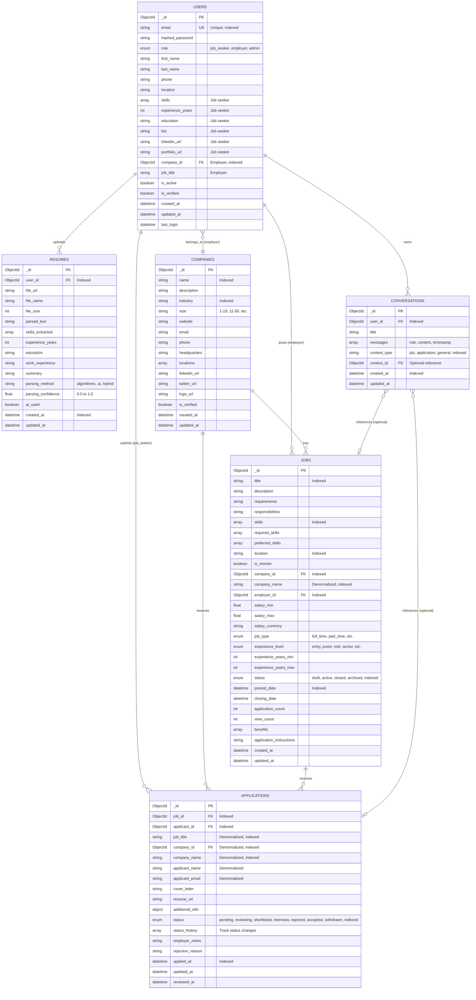

# Entity-Relationship Diagram (ERD)

## TalentNest Database Schema

This document provides a comprehensive overview of the MongoDB database schema for the TalentNest Job Portal application.

---

## Database Overview

**Database Type:** MongoDB (NoSQL Document Database)  
**ODM:** Beanie (async Object-Document Mapper)  
**Total Collections:** 6

---

## Collections Summary

| Collection | Purpose | Key Relationships |
|------------|---------|-------------------|
| `users` | Job seekers and employers | → companies (employer), → jobs (posted by), → applications (submitted by), → resumes (uploaded by), → conversations (chat history) |
| `companies` | Company profiles | ← users (employees), ← jobs (posted for), ← applications (received for) |
| `jobs` | Job postings | ← users (employer), ← companies, → applications (received) |
| `applications` | Job applications | ← users (applicant), ← jobs (applied to), ← companies (for company) |
| `resumes` | Uploaded resumes | ← users (owner) |
| `conversations` | AI assistant chats | ← users (owner), → jobs/applications (optional context) |

---

## Entity-Relationship Diagram

---

## Detailed Collection Schemas

### 1. Users Collection

**Collection Name:** `users`

**Purpose:** Stores user accounts for both job seekers and employers.

**Key Fields:**
- `email` (EmailStr, unique, indexed): User's email address
- `role` (enum): `job_seeker`, `employer`, or `admin`
- `company_id` (ObjectId, optional): Links employer to their company

**Indexes:**
- `email` (unique)
- `role`
- `company_id`

**Relationships:**
- **One-to-Many** with Jobs (as employer)
- **One-to-Many** with Applications (as applicant)
- **One-to-Many** with Resumes
- **One-to-Many** with Conversations
- **Many-to-One** with Companies (employers only)

---

### 2. Companies Collection

**Collection Name:** `companies`

**Purpose:** Stores company profiles for employers.

**Key Fields:**
- `name` (string, indexed): Company name
- `industry` (string, indexed): Industry sector
- `size` (string): Employee count range

**Indexes:**
- `name`
- `industry`

**Relationships:**
- **One-to-Many** with Users (employees)
- **One-to-Many** with Jobs
- **One-to-Many** with Applications (denormalized)

---

### 3. Jobs Collection

**Collection Name:** `jobs`

**Purpose:** Stores job postings created by employers.

**Key Fields:**
- `company_id` (ObjectId, indexed): Reference to company
- `employer_id` (ObjectId, indexed): Reference to user who posted
- `company_name` (string, indexed): Denormalized for faster queries
- `status` (enum, indexed): `draft`, `active`, `closed`, `archived`
- `skills` (array, indexed): Required skills for searching

**Indexes:**
- `title`
- `company_id`
- `employer_id`
- `status`
- `location`
- `skills`
- `company_name`
- `posted_date`

**Relationships:**
- **Many-to-One** with Companies
- **Many-to-One** with Users (employer)
- **One-to-Many** with Applications

---

### 4. Applications Collection

**Collection Name:** `applications`

**Purpose:** Stores job applications submitted by job seekers.

**Key Fields:**
- `job_id` (ObjectId, indexed): Reference to job
- `applicant_id` (ObjectId, indexed): Reference to user
- `company_id` (ObjectId, indexed): Denormalized from job
- `status` (enum, indexed): Application status
- `status_history` (array): Tracks all status changes

**Indexes:**
- `job_id`
- `applicant_id`
- `status`
- `company_id`
- `applied_at`
- Compound index: `(job_id, applicant_id)` for uniqueness

**Relationships:**
- **Many-to-One** with Jobs
- **Many-to-One** with Users (applicant)
- **Many-to-One** with Companies (denormalized)

---

### 5. Resumes Collection

**Collection Name:** `resumes`

**Purpose:** Stores uploaded resumes and AI-parsed data.

**Key Fields:**
- `user_id` (ObjectId, indexed): Reference to user
- `file_url` (string): Path to stored file
- `parsed_text` (string): Extracted text content
- `skills_extracted` (array): AI-extracted skills
- `parsing_method` (string): How resume was parsed

**Indexes:**
- `user_id`
- `created_at`

**Relationships:**
- **Many-to-One** with Users

---

### 6. Conversations Collection

**Collection Name:** `conversations`

**Purpose:** Stores AI assistant chat history.

**Key Fields:**
- `user_id` (ObjectId, indexed): Reference to user
- `messages` (array): Chat messages with role and content
- `context_type` (string, indexed): `job`, `application`, or `general`
- `context_id` (ObjectId, optional): Reference to job or application

**Indexes:**
- `user_id`
- `context_type`
- `created_at`
- Compound index: `(user_id, context_type)`

**Relationships:**
- **Many-to-One** with Users
- **Optional Many-to-One** with Jobs (context)
- **Optional Many-to-One** with Applications (context)

---

## Relationship Types

### Direct References (Foreign Keys)
- `users.company_id` → `companies._id`
- `jobs.company_id` → `companies._id`
- `jobs.employer_id` → `users._id`
- `applications.job_id` → `jobs._id`
- `applications.applicant_id` → `users._id`
- `resumes.user_id` → `users._id`
- `conversations.user_id` → `users._id`
- `conversations.context_id` → `jobs._id` or `applications._id` (optional)

### Denormalized Fields (for Performance)
- `jobs.company_name` (from `companies.name`)
- `applications.job_title` (from `jobs.title`)
- `applications.company_id` (from `jobs.company_id`)
- `applications.company_name` (from `jobs.company_name`)
- `applications.applicant_name` (from `users.first_name + last_name`)
- `applications.applicant_email` (from `users.email`)

**Why Denormalization?**
MongoDB is a NoSQL database, and denormalization is a common pattern to:
- Reduce the need for joins (lookups)
- Improve query performance
- Simplify common queries (e.g., listing applications with job and company info)

---

## Key Design Decisions

### 1. **Role-Based User Model**
Instead of separate collections for job seekers and employers, we use a single `users` collection with a `role` field. This simplifies authentication and allows users to potentially have multiple roles.

### 2. **Denormalization Strategy**
Frequently accessed data (like company name, job title) is denormalized into child collections to avoid expensive lookups in read-heavy operations.

### 3. **Status Tracking**
Both `jobs` and `applications` have status enums and history tracking to maintain audit trails.

### 4. **Compound Indexes**
Strategic compound indexes (e.g., `job_id + applicant_id`) ensure uniqueness and optimize common query patterns.

### 5. **Optional Context in Conversations**
The AI assistant can maintain general conversations or job/application-specific conversations through optional context fields.

### 6. **AI Integration Fields**
The `resumes` collection includes fields for AI parsing metadata, and `conversations` stores chat history for the AI assistant.

---

## Query Patterns

### Common Queries Optimized by This Schema:

1. **Find all jobs for a company** → Indexed on `jobs.company_id`
2. **Find all applications for a job** → Indexed on `applications.job_id`
3. **Find all applications by a user** → Indexed on `applications.applicant_id`
4. **Search jobs by skills** → Indexed on `jobs.skills`
5. **Search jobs by location** → Indexed on `jobs.location`
6. **Find active jobs** → Indexed on `jobs.status`
7. **Get user's resumes** → Indexed on `resumes.user_id`
8. **Get user's conversations** → Indexed on `conversations.user_id`
9. **Prevent duplicate applications** → Compound index on `(job_id, applicant_id)`

---

## Data Integrity

### Referential Integrity
While MongoDB doesn't enforce foreign key constraints like SQL databases, our application logic ensures:
- Users can only apply to existing jobs
- Applications reference valid users and jobs
- Employers can only post jobs for their company
- Resumes belong to valid users

### Validation
Beanie ODM provides:
- Field type validation
- Required field enforcement
- Enum validation
- Custom validators (e.g., email format)

---

## Scalability Considerations

1. **Indexes:** All foreign keys and frequently queried fields are indexed
2. **Denormalization:** Reduces need for expensive lookups
3. **Pagination:** Supported through indexed `created_at` and `posted_date` fields
4. **Sharding Ready:** Can shard by `company_id` or `user_id` if needed
5. **Read Replicas:** MongoDB Atlas supports read replicas for scaling reads

---

## Future Enhancements

Potential schema additions for future features:
- **Interviews Collection:** Track scheduled interviews
- **Messages Collection:** Direct messaging between users
- **Notifications Collection:** Store user notifications
- **Analytics Collection:** Store aggregated metrics
- **Saved Jobs Collection:** Track jobs saved by users
- **Job Alerts Collection:** Store user job alert preferences

---

## Summary

This ERD represents a well-designed MongoDB schema that:
- ✅ Supports all current features (job posting, applications, AI assistant, resume parsing)
- ✅ Uses strategic denormalization for performance
- ✅ Includes comprehensive indexes for common queries
- ✅ Maintains audit trails (status history, timestamps)
- ✅ Scales efficiently with proper indexing and denormalization
- ✅ Provides flexibility for future enhancements

---

**Last Updated:** November 2024  
**Version:** 1.0  
**Maintained By:** TalentNest Development Team

